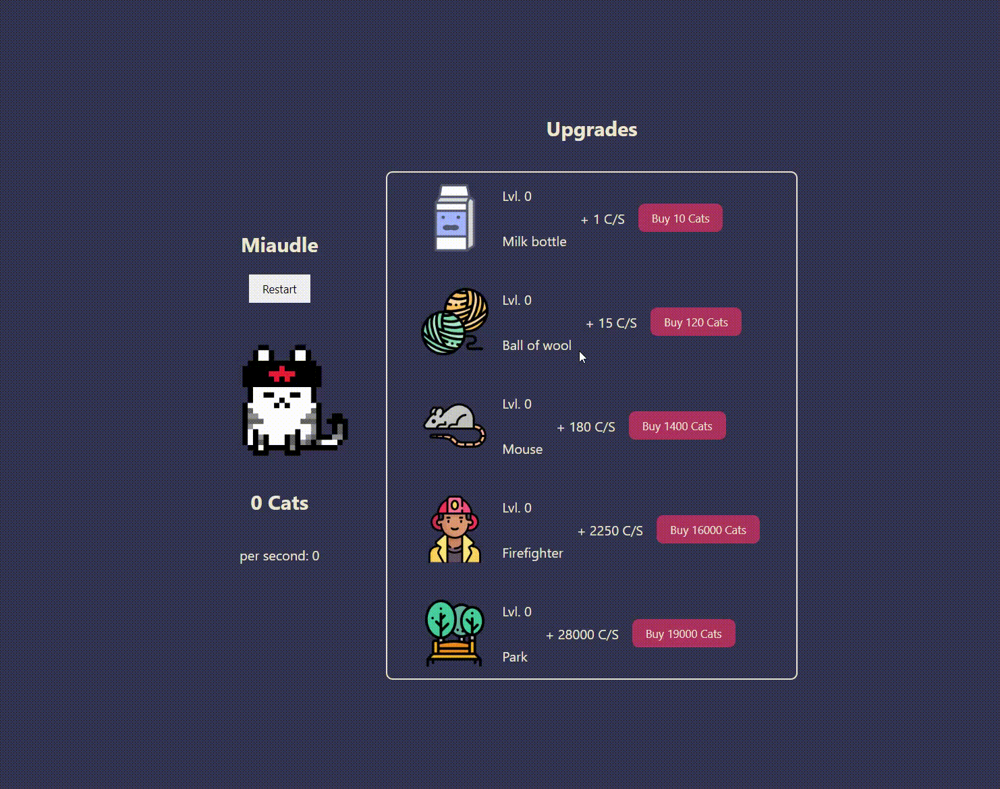

# Cat Collector Clicker



Cat Collector Clicker is an incremental and clicker game where you collect adorable cats. You can use the cats you collect to purchase various upgrades, which will increase your cat generation rate per second.

## Demo

You can try out the game by visiting the [Cat Collector Clicker Demo](https://miaudle.vercel.app/).

## Getting Started

Follow these steps to download and run Cat Collector Clicker locally on your machine.

### Prerequisites

Make sure you have the following software installed on your system:

- [Node.js](https://nodejs.org/) (>=12.0.0)
- [npm](https://www.npmjs.com/)

### Installation

1. Clone the repository to your local machine:

   ```bash
   git clone https://github.com/Rafacv23/idle-game
   ```
2. Navigate to the repository:

    ```bash
    cd 11-idle-videogame
    ```

3. Install the dependencies:

    ```bash
    npm install
    ```

4. Run the game:

    ```bash
    npm start
    ```

## Technologies Used

- React
- Native CSS

## How to Play
- Click on the cat to collect them.
- Use the collected cats to purchase upgrades.
- Upgrades will increase your cat generation rate per second.

## Contributing
Contributions are welcome! If you'd like to contribute to the project, please follow the contribution guidelines.

Made with ❤️ by Rafa Canosa 